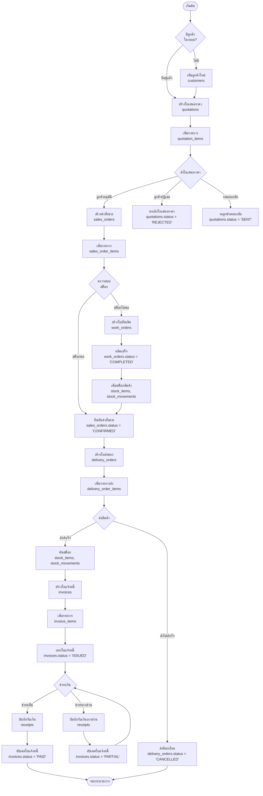
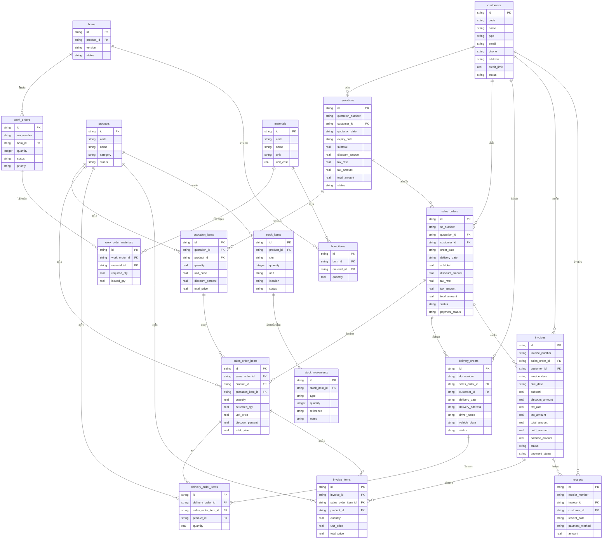

# ระบบบัญชี - Sales & Accounting Module Flowchart

## 🔄 กระบวนการทำงานหลัก (Main Workflow)



---

## 📊 ตาราง Database ที่ใช้ในแต่ละขั้นตอน

### 1. ขั้นตอน CRM (ลูกค้า)
| ขั้นตอน | ตารางหลัก | ตารางที่เชื่อมโยง | คำอธิบาย |
|---------|----------|------------------|---------|
| เพิ่มลูกค้า | `customers` | - | เก็บข้อมูลลูกค้า |

**ข้อมูลที่ดึง:**
- `customers.id` → ใช้เป็น `customer_id` ในทุกตาราง

---

### 2. ขั้นตอน Quotation (ใบเสนอราคา)
| ขั้นตอน | ตารางหลัก | ตารางที่เชื่อมโยง | คำอธิบาย |
|---------|----------|------------------|---------|
| สร้าง QT | `quotations` | `customers` | เก็บข้อมูลใบเสนอราคา |
| เพิ่มรายการ | `quotation_items` | `quotations`, `products` | รายละเอียดสินค้า |

**ข้อมูลที่ดึง:**
```sql
-- จาก customers
SELECT id, name, code, email, phone, address 
FROM customers WHERE id = ?

-- จาก products (สำหรับเพิ่มรายการ)
SELECT id, name, code 
FROM products WHERE id = ?
```

---

### 3. ขั้นตอน Sales Order (คำสั่งขาย)
| ขั้นตอน | ตารางหลัก | ตารางที่เชื่อมโยง | คำอธิบาย |
|---------|----------|------------------|---------|
| สร้าง SO | `sales_orders` | `customers`, `quotations` | คำสั่งซื้อที่ยืนยันแล้ว |
| เพิ่มรายการ | `sales_order_items` | `sales_orders`, `products`, `quotation_items` | รายละเอียดสินค้า |

**ข้อมูลที่ดึง:**
```sql
-- จาก quotations (ถ้าสร้างจาก QT)
SELECT * FROM quotations WHERE id = ?

-- จาก quotation_items (copy รายการ)
SELECT * FROM quotation_items WHERE quotation_id = ?

-- จาก stock_items (ตรวจสอบสต็อก)
SELECT quantity FROM stock_items 
WHERE product_id = ? AND tenant_id = ?
```

---

### 4. ขั้นตอน Stock Check (ตรวจสอบสต็อก)
| ขั้นตอน | ตารางหลัก | ตารางที่เชื่อมโยง | คำอธิบาย |
|---------|----------|------------------|---------|
| ตรวจสอบสต็อก | `stock_items` | `products` | เช็คจำนวนคงเหลือ |
| สร้างใบสั่งผลิต | `work_orders` | `boms`, `sales_orders` | สั่งผลิตเพิ่ม |

**ข้อมูลที่ดึง:**
```sql
-- ตรวจสอบสต็อก
SELECT si.quantity, si.id 
FROM stock_items si 
WHERE si.product_id = ? AND si.tenant_id = ?

-- ดึง BOM สำหรับผลิต
SELECT b.id, b.version 
FROM boms b 
WHERE b.product_id = ? AND b.tenant_id = ?

-- ดึงวัตถุดิบจาก BOM
SELECT bi.material_id, bi.quantity, m.unit_cost
FROM bom_items bi
JOIN materials m ON bi.material_id = m.id
WHERE bi.bom_id = ?
```

---

### 5. ขั้นตอน Work Order (การผลิต)
| ขั้นตอน | ตารางหลัก | ตารางที่เชื่อมโยง | คำอธิบาย |
|---------|----------|------------------|---------|
| สร้าง WO | `work_orders` | `boms` | ใบสั่งผลิต |
| วัตถุดิบ | `work_order_materials` | `work_orders`, `materials` | รายการวัตถุดิบ |

**ข้อมูลที่ดึง:**
```sql
-- ดึง BOM Items
SELECT bi.material_id, bi.quantity, m.name, m.unit
FROM bom_items bi
JOIN materials m ON bi.material_id = m.id
WHERE bi.bom_id = ?
```

---

### 6. ขั้นตอน Delivery (การส่งสินค้า)
| ขั้นตอน | ตารางหลัก | ตารางที่เชื่อมโยง | คำอธิบาย |
|---------|----------|------------------|---------|
| สร้าง DO | `delivery_orders` | `sales_orders`, `customers` | ใบส่งของ |
| รายการส่ง | `delivery_order_items` | `delivery_orders`, `sales_order_items`, `products` | รายละเอียด |

**ข้อมูลที่ดึง:**
```sql
-- จาก sales_order_items
SELECT soi.id, soi.product_id, soi.quantity, soi.delivered_qty
FROM sales_order_items soi
WHERE soi.sales_order_id = ?

-- ตัดสต็อกเมื่อส่งสำเร็จ
UPDATE stock_items 
SET quantity = quantity - ? 
WHERE product_id = ? AND tenant_id = ?

-- บันทึก movement
INSERT INTO stock_movements 
(stock_item_id, type, quantity, reference, notes)
VALUES (?, 'OUT', ?, ?, ?)
```

---

### 7. ขั้นตอน Invoicing (ใบแจ้งหนี้)
| ขั้นตอน | ตารางหลัก | ตารางที่เชื่อมโยง | คำอธิบาย |
|---------|----------|------------------|---------|
| สร้าง INV | `invoices` | `sales_orders`, `customers` | ใบแจ้งหนี้ |
| รายการ | `invoice_items` | `invoices`, `sales_order_items`, `products` | รายละเอียด |

**ข้อมูลที่ดึง:**
```sql
-- จาก sales_orders
SELECT subtotal, discount_amount, tax_rate, tax_amount, total_amount
FROM sales_orders WHERE id = ?

-- จาก sales_order_items
SELECT soi.id, soi.product_id, soi.quantity, soi.unit_price, soi.total_price
FROM sales_order_items soi
WHERE soi.sales_order_id = ?
```

---

### 8. ขั้นตอน Payment (การรับชำระ)
| ขั้นตอน | ตารางหลัก | ตารางที่เชื่อมโยง | คำอธิบาย |
|---------|----------|------------------|---------|
| รับเงิน | `receipts` | `invoices`, `customers` | ใบเสร็จรับเงิน |

**ข้อมูลที่ดึง:**
```sql
-- จาก invoices
SELECT total_amount, paid_amount, balance_amount
FROM invoices WHERE id = ?

-- อัปเดตใบแจ้งหนี้
UPDATE invoices 
SET paid_amount = paid_amount + ?,
    balance_amount = total_amount - (paid_amount + ?),
    payment_status = CASE 
      WHEN balance_amount = 0 THEN 'PAID'
      ELSE 'PARTIAL'
    END
WHERE id = ?
```

---

## 🔄 Entity Relationship Diagram



---

## 📋 API Endpoints Summary

### Sales Module Routes (`/api/sales`)

| Method | Endpoint | คำอธิบาย | ตารางที่ใช้ |
|--------|----------|---------|------------|
| GET | `/summary` | ดูสถิติรวม | sales_orders, invoices, receipts |
| GET | `/quotations` | รายการใบเสนอราคา | quotations, quotation_items |
| POST | `/quotations` | สร้างใบเสนอราคา | quotations, quotation_items |
| GET | `/quotations/:id` | ดูรายละเอียด QT | quotations, quotation_items |
| PUT | `/quotations/:id/status` | อัปเดตสถานะ QT | quotations |
| GET | `/sales-orders` | รายการคำสั่งขาย | sales_orders, sales_order_items |
| POST | `/sales-orders` | สร้างคำสั่งขาย | sales_orders, sales_order_items |
| GET | `/sales-orders/:id` | ดูรายละเอียด SO | sales_orders, sales_order_items |
| PUT | `/sales-orders/:id/status` | อัปเดตสถานะ SO | sales_orders |
| GET | `/delivery-orders` | รายการใบส่งของ | delivery_orders, delivery_order_items |
| POST | `/delivery-orders` | สร้างใบส่งของ | delivery_orders, delivery_order_items |
| PUT | `/delivery-orders/:id/status` | อัปเดตสถานะ DO + ตัดสต็อก | delivery_orders, stock_items, stock_movements |
| GET | `/invoices` | รายการใบแจ้งหนี้ | invoices, invoice_items |
| POST | `/invoices` | สร้างใบแจ้งหนี้ | invoices, invoice_items |
| PUT | `/invoices/:id/status` | อัปเดตสถานะ INV | invoices |
| POST | `/receipts` | บันทึกการรับเงิน | receipts, invoices |

---

## 🎯 สรุป

ระบบ Sales Module ประกอบด้วย:

1. **9 ตารางใหม่:**
   - `quotations`, `quotation_items`
   - `sales_orders`, `sales_order_items`
   - `delivery_orders`, `delivery_order_items`
   - `invoices`, `invoice_items`
   - `receipts`

2. **เชื่อมโยงกับตารางเดิม:**
   - `customers` - ข้อมูลลูกค้า
   - `products` - ข้อมูลสินค้า
   - `stock_items`, `stock_movements` - การจัดการสต็อก
   - `boms`, `work_orders` - การผลิต (กรณีสต็อกไม่พอ)

3. **Flow หลัก:**
   ```
   QT → SO → (ตรวจสต็อก → WO ถ้าขาด) → DO → INV → Receipt
   ```
