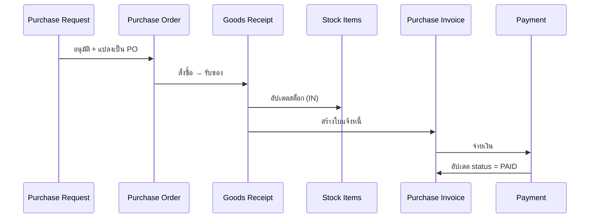
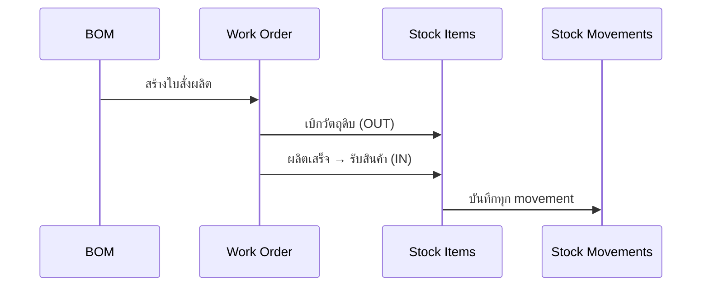
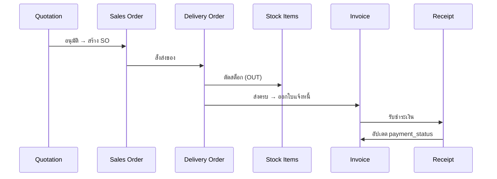
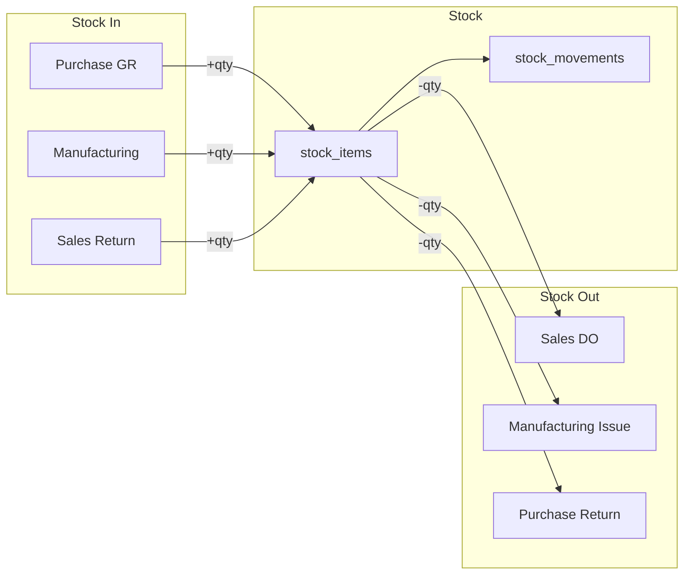

# วิเคราะห์ Database Integration - ระบบ CRM-BOM-Stock

## 📊 ภาพรวมการเชื่อมโยงระหว่างโมดูล

```mermaid
flowchart TB
    subgraph MASTER[Master Data]
        USERS[users]
        CUSTOMERS[customers]
        SUPPLIERS[suppliers]
        PRODUCTS[products]
        MATERIALS[materials]
        MAT_CAT[material_categories]
    end

    subgraph BOM_MODULE[BOM Module]
        BOMS[boms]
        BOM_ITEMS[bom_items]
    end

    subgraph PURCHASE_MODULE[Purchase Module]
        PR[purchase_requests]
        PRI[purchase_request_items]
        PO[purchase_orders]
        POI[purchase_order_items]
        GR[goods_receipts]
        GRI[goods_receipt_items]
        PI[purchase_invoices]
        PII[purchase_invoice_items]
        SPAY[supplier_payments]
        PRET[purchase_returns]
        PRETI[purchase_return_items]
    end

    subgraph STOCK_MODULE[Stock Module]
        SI[stock_items]
        SM[stock_movements]
    end

    subgraph SALES_MODULE[Sales Module]
        QT[quotations]
        QTI[quotation_items]
        SO[sales_orders]
        SOI[sales_order_items]
        DO[delivery_orders]
        DOI[delivery_order_items]
        INV[invoices]
        INVI[invoice_items]
        REC[receipts]
        BO[backorders]
        BOI[backorder_items]
        CN[credit_notes]
        CNI[credit_note_items]
    end

    subgraph PRODUCTION_MODULE[Production Module]
        WO[work_orders]
        WOM[work_order_materials]
    end

    subgraph MARKETING_MODULE[Marketing Module]
        SHOPS[shops]
        MF[marketing_files]
        MM[marketing_metrics]
    end

    %% MASTER RELATIONSHIPS
    MAT_CAT --> MATERIALS
    PRODUCTS --> BOMS
    MATERIALS --> BOM_ITEMS
    BOMS --> BOM_ITEMS

    %% BOM TO PRODUCTION
    BOMS --> WO
    BOM_ITEMS --> WOM
    MATERIALS --> WOM

    %% PRODUCTION TO STOCK
    WO -.->|ผลิตเสร็จ| SI
    WOM -.->|เบิกวัตถุดิบ| SM

    %% PURCHASE FLOW
    MATERIALS --> PRI
    MATERIALS --> POI
    PR --> PRI
    PR -.->|แปลง| PO
    PO --> POI
    SUPPLIERS --> PO
    SUPPLIERS --> GR
    SUPPLIERS --> PI
    SUPPLIERS --> SPAY
    SUPPLIERS --> PRET
    PO --> GR
    POI --> GRI
    PO --> PI
    GR --> PI
    GR --> GRI
    GRI --> PII
    PI --> PII
    PI --> SPAY
    GR --> PRET
    GRI --> PRETI
    PRET --> PRETI

    %% PURCHASE TO STOCK
    GR -.->|รับเข้า| SI
    GRI -.->|รับเข้า| SM
    PRET -.->|คืนออก| SM

    %% SALES FLOW
    CUSTOMERS --> QT
    CUSTOMERS --> SO
    CUSTOMERS --> DO
    CUSTOMERS --> INV
    CUSTOMERS --> REC
    PRODUCTS --> QTI
    PRODUCTS --> SOI
    PRODUCTS --> DOI
    PRODUCTS --> INVI
    QT --> QTI
    QT -.->|อนุมัติ| SO
    SO --> SOI
    QTI -.->|copy| SOI
    SO --> DO
    SOI --> DOI
    DO --> DOI
    DO -.->|ส่งของ| BO
    SOI --> BOI
    BO --> BOI
    DO -.->|ส่งครบ| INV
    SO --> INV
    SOI --> INVI
    INV --> INVI
    INV --> REC
    INV -.->|คืนของ/ลดหนี้| CN
    INVI --> CNI
    CN --> CNI

    %% SALES TO STOCK
    DO -.->|ตัดสต็อก| SM
    DOI -.->|ตัดสต็อก| SI

    %% STOCK INTERNAL
    SI --> SM
    MATERIALS --> SI
    PRODUCTS --> SI

    %% MARKETING
    SHOPS --> MF
    SHOPS --> MM
    MF --> MM
```



---

## 🔗 Foreign Keys ที่สำคัญ

### 1. BOM → Production → Stock
| ตาราง | FK | เชื่อมไป | ความสำคัญ |
|-------|-----|---------|-----------|
| `boms` | product_id | products | สินค้าที่ผลิต |
| `bom_items` | bom_id | boms | BOM หลัก |
| `bom_items` | material_id | materials | วัตถุดิบที่ใช้ |
| `work_orders` | bom_id | boms | อ้างอิง BOM |
| `work_order_materials` | work_order_id | work_orders | เบิกวัตถุดิบ |
| `work_order_materials` | material_id | materials | วัตถุดิบ |

**Flow:**
```
BOM (product) → Work Order → เบิก materials → ผลิตเสร็จ → Stock
```

### 2. Purchase → Stock
| ตาราง | FK | เชื่อมไป | ความสำคัญ |
|-------|-----|---------|-----------|
| `purchase_orders` | supplier_id | suppliers | ผู้ขาย |
| `purchase_order_items` | purchase_order_id | purchase_orders | PO |
| `purchase_order_items` | material_id | materials | วัตถุดิบ |
| `goods_receipts` | purchase_order_id | purchase_orders | รับจาก PO |
| `goods_receipts` | supplier_id | suppliers | ผู้ส่ง |
| `goods_receipt_items` | goods_receipt_id | goods_receipts | GR |
| `goods_receipt_items` | purchase_order_item_id | purchase_order_items | รายการ PO |
| `goods_receipt_items` | material_id | materials | วัตถุดิบ |

**Flow:**
```
PO → GR → Stock (IN) → Purchase Invoice → Payment
```

**⚠️ ปัญหาที่อาจเกิด:**
- `purchase_request_items` → ไม่มี FK ไป `purchase_orders` (ต้อง update PR.status = 'CONVERTED')
- `goods_receipts` → ไม่มี direct link ไป `stock_items` (ต้องหา material_id ก่อน)

### 3. Sales → Stock
| ตาราง | FK | เชื่อมไป | ความสำคัญ |
|-------|-----|---------|-----------|
| `sales_orders` | customer_id | customers | ลูกค้า |
| `sales_orders` | quotation_id | quotations | อ้างอิง QT |
| `sales_order_items` | sales_order_id | sales_orders | SO |
| `sales_order_items` | product_id | products | สินค้า |
| `sales_order_items` | quotation_item_id | quotation_items | อ้างอิง QT |
| `delivery_orders` | sales_order_id | sales_orders | ส่งจาก SO |
| `delivery_orders` | customer_id | customers | ลูกค้า |
| `delivery_order_items` | delivery_order_id | delivery_orders | DO |
| `delivery_order_items` | sales_order_item_id | sales_order_items | รายการ SO |
| `delivery_order_items` | product_id | products | สินค้า |
| `invoices` | sales_order_id | sales_orders | ออกจาก SO |
| `invoices` | customer_id | customers | ลูกค้า |
| `invoice_items` | invoice_id | invoices | INV |
| `invoice_items` | sales_order_item_id | sales_order_items | รายการ SO |
| `invoice_items` | product_id | products | สินค้า |

**Flow:**
```
QT → SO → DO → Stock (OUT) → Invoice → Receipt
```

### 4. Stock (Central Hub)
| ตาราง | FK | เชื่อมไป | ความสำคัญ |
|-------|-----|---------|-----------|
| `stock_items` | product_id | products | สินค้า |
| `stock_items` | material_id | materials | วัตถุดิบ |
| `stock_movements` | stock_item_id | stock_items | สต็อก |

**Stock รับจาก:**
- Purchase (Goods Receipt)
- Production (Work Order ผลิตเสร็จ)
- Sales Return (Credit Note)

**Stock ออกจาก:**
- Sales (Delivery Order)
- Production (Work Order เบิก)
- Purchase Return

---

## 🔄 Complete Business Flows

### Flow 1: ซื้อวัตถุดิบ (Procurement)


### Flow 2: ผลิตสินค้า (Manufacturing)


### Flow 3: ขายสินค้า (Sales)


### Flow 4: Stock Movement รวม


---

## ⚠️ จุดที่ต้องระวัง (Potential Issues)

### 1. Data Consistency
| ปัญหา | ตาราง | แนวทางแก้ไข |
|-------|-------|-------------|
| PR → PO แล้ว PR ยังแก้ไขได้ | purchase_requests | ต้อง lock PR เมื่อ status = 'CONVERTED' |
| QT → SO แล้ว QT ยังแก้ไขได้ | quotations | ต้อง lock QT เมื่อ status = 'ACCEPTED' |
| ยกเลิก GR แล้ว stock ไม่ลด | goods_receipts | ต้องสร้าง reversal movement |
| ยกเลิก DO แล้ว stock ไม่คืน | delivery_orders | ต้องสร้าง reversal movement |

### 2. Missing Integration Points
| จาก | ไป | สถานะ | แนวทาง |
|------|-----|--------|--------|
| `work_orders` | `stock_items` (finished goods) | ⚠️ ไม่ชัดเจน | ต้องมีการระบุ product_id ที่ผลิต |
| `credit_notes` | `stock_items` | ❌ ไม่มี | คืนของต้องเพิ่มสต็อก |
| `purchase_returns` | `stock_items` | ✅ มี | คืนของแล้วตัดสต็อก |

### 3. Cascade Delete Risks
```sql
-- อันตราย! ลบ PO แล้ว GR หาย
FOREIGN KEY (purchase_order_id) REFERENCES purchase_orders(id)
-- แต่ GR ต้องคงอยู่เพื่อประวัติ

-- อันตราย! ลบ SO แล้ว DO หาย
FOREIGN KEY (sales_order_id) REFERENCES sales_orders(id)
-- แต่ DO ต้องคงอยู่เพื่อประวัติการส่ง
```

**แนะนำ:** ใช้ soft delete (status = 'CANCELLED') แทน DELETE

---

## 📋 สรุป Integration Matrix

| From ↓ / To → | Stock | Purchase | Sales | Production | BOM |
|---------------|-------|----------|-------|------------|-----|
| **Stock** | - | GR → Stock | DO → Stock | WO Issue/Receive | - |
| **Purchase** | GR ← Material | - | - | - | - |
| **Sales** | DO ← Product | - | - | - | - |
| **Production** | WO → Stock | Material → PO | - | - | BOM → WO |
| **BOM** | - | - | - | WO ← BOM | - |

---

## ✅ การทำงานที่ถูกต้อง (Correct Flow)

### เมื่อสร้าง Goods Receipt:
1. ✅ ตรวจสอบ PO มีอยู่และ status = 'APPROVED'
2. ✅ สร้าง GR record
3. ✅ สร้าง GR items (ระบุ accepted_qty, rejected_qty)
4. ✅ อัปเดต stock_items.quantity (+)
5. ✅ สร้าง stock_movements (type='IN')
6. ✅ อัปเดต purchase_order_items.received_qty
7. ✅ ถ้ารับครบ อัปเดต PO.status = 'RECEIVED'
8. ✅ ถ้ารับบางส่วน อัปเดต PO.status = 'PARTIAL'

### เมื่อสร้าง Delivery Order:
1. ✅ ตรวจสอบ SO มีอยู่และ status = 'CONFIRMED'
2. ✅ ตรวจสอบ stock เพียงพอ
3. ✅ สร้าง DO record
4. ✅ สร้าง DO items
5. ✅ อัปเดต stock_items.quantity (-)
6. ✅ สร้าง stock_movements (type='OUT')
7. ✅ อัปเดต sales_order_items.delivered_qty
8. ✅ ถ้าส่งครบ อัปเดต SO.status = 'DELIVERED'
9. ✅ ถ้าส่งบางส่วน อัปเดต SO.status = 'PARTIAL'

### เมื่อ Work Order ผลิตเสร็จ:
1. ✅ เบิกวัตถุดิบตาม BOM
2. ✅ ตัด stock_materials (OUT)
3. ✅ เพิ่ม stock_products (IN)
4. ✅ อัปเดต work_order.status = 'COMPLETED'
5. ✅ บันทึก actual_cost

---

## 🎯 ข้อแนะนำเพิ่มเติม

### 1. เพิ่ม Trigger หรือ Validation
```sql
-- ตรวจสอบ stock ต้องไม่ติดลบ
CREATE TRIGGER check_stock_before_out
BEFORE UPDATE ON stock_items
BEGIN
  SELECT CASE
    WHEN NEW.quantity < 0 THEN
      RAISE(ABORT, 'Insufficient stock')
  END;
END;
```

### 2. เพิ่ม Audit Log
```sql
-- บันทึกการเปลี่ยนแปลงสำคัญ
CREATE TABLE audit_logs (
  id TEXT PRIMARY KEY,
  table_name TEXT,
  record_id TEXT,
  action TEXT,  -- CREATE, UPDATE, DELETE
  old_values TEXT,
  new_values TEXT,
  changed_by TEXT,
  changed_at TEXT
);
```

### 3. Soft Delete แทน Hard Delete
แทนที่จะ `DELETE` ใช้:
```sql
UPDATE purchase_orders SET status = 'CANCELLED', deleted_at = ? WHERE id = ?
```

---

## 📊 สรุป

✅ **Integration ครบถ้วนดี:**
- BOM → Production → Stock ✅
- Purchase → Stock → Invoice → Payment ✅
- Sales → Stock → Invoice → Receipt ✅

⚠️ **ต้องระวัง:**
- Cascade delete อาจทำให้ประวัติหาย
- ต้องมี transaction ครอบคลุมทุก operation
- ต้อง validate stock ก่อนตัดทุกครั้ง

✅ **Database Design ดี:**
- Foreign keys ครบถ้วน
- Indexes เพียงพอ
- Normalization ดี
