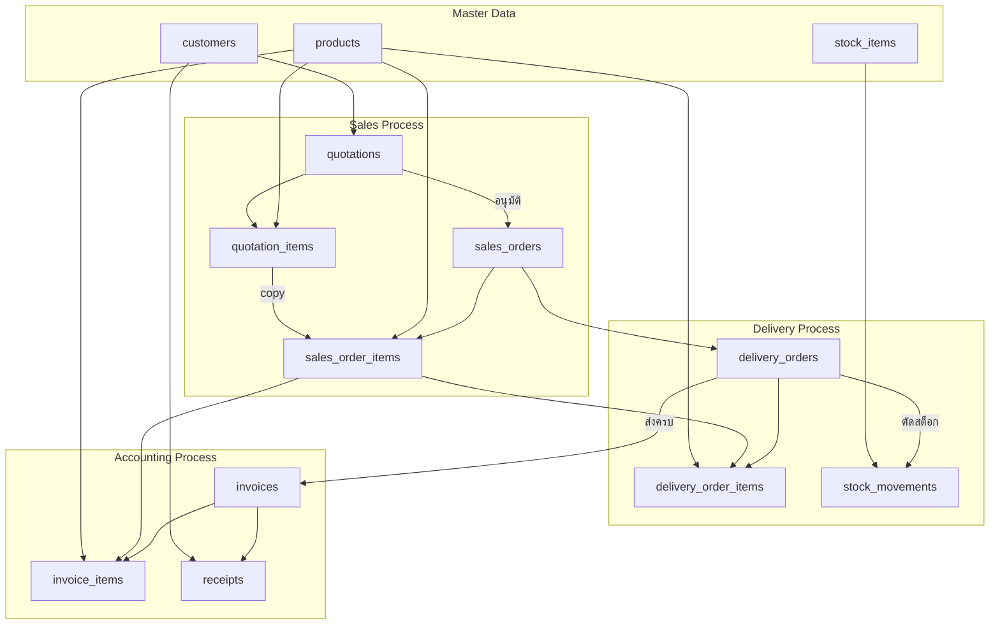
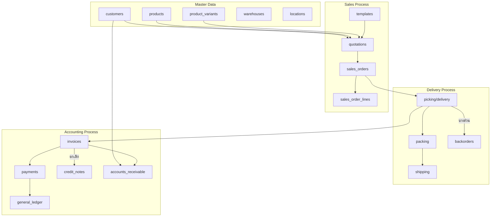

# เปรียบเทียบ Sales Workflow: ระบบที่สร้าง vs ERP มาตรฐาน (Odoo/ERPNext)

## 📊 ตารางเปรียบเทียบภาพรวม

| ฟีเจอร์ | ระบบ CRM-BOM-Stock (ที่สร้าง) | ERP มาตรฐาน (Odoo/ERPNext) | หมายเหตุ |
|---------|-------------------------------|---------------------------|----------|
| **Master Data** | ✅ Customers, Products | ✅ Customers, Products, Product Variants | ระบบเรายังไม่มี Product Variants |
| **Quotation** | ✅ มี | ✅ มี + Templates | ระบบเรายังไม่มี Templates |
| **Sales Order** | ✅ มี | ✅ มี + Multiple Shipping Addresses | ระบบเรามี 1 ที่อยู่ต่อ SO |
| **Delivery Order** | ✅ มี + Auto Stock Deduct | ✅ มี + Partial Delivery + Backorder | ระบบเรายังไม่มี Partial Delivery |
| **Invoice** | ✅ มี (จาก SO) | ✅ มี + Standalone INV + Credit Note | ระบบเราต้องสร้างจาก SO เท่านั้น |
| **Payment** | ✅ มี (Full/Partial) | ✅ มี + Multiple Payment Methods + Deposit | ระบบเรามีพื้นฐาน |
| **Credit Limit** | ✅ มี (ตาราง customers) | ✅ มี + Credit Hold | ระบบเรายังไม่มี Credit Hold |
| **Tax** | ✅ มี (7% ค่าเริ่มต้น) | ✅ มี + Multiple Tax Rates + Withholding Tax | ระบบเราอย่างง่าย |
| **Discount** | ✅ มี (รายการ/ท้ายบิล) | ✅ มี + Promotions + Loyalty Programs | ระบบเราอย่างง่าย |
| **Multi-warehouse** | ❌ ไม่มี | ✅ มี | ระบบเรามีสถานที่เดียว |
| **Multi-currency** | ❌ ไม่มี | ✅ มี | ระบบเรา THB อย่างเดียว |
| **Online Payment** | ❌ ไม่มี | ✅ มี (QR Code, Credit Card) | ระบบเราเก็บธนคม. เอง |
| **E-commerce Integration** | ⚠️ Marketing (Shopee) แยก | ✅ Fully Integrated | Marketing Module แยกต่างหาก |
| **Returns** | ❌ ไม่มี | ✅ Return Order + Credit Note | ยังไม่ได้สร้าง |
| **Reports** | ❌ ไม่มี | ✅ มี | ต้องสร้างเพิ่ม |

---

## 🔄 Workflow Comparison

### ระบบที่สร้าง (CRM-BOM-Stock)



### ERP มาตรฐาน (Odoo/ERPNext)



---

## 📋 รายละเอียดการเปรียบเทียบแต่ละขั้นตอน

### 1. Quotation (ใบเสนอราคา)

| Feature | ระบบเรา | ERP มาตรฐาน |
|---------|---------|-------------|
| **สร้างจาก** | Customer + Products | Customer + Products + Templates |
| **ระยะเวลา** | มี expiry_date | มี expiry_date + Reminder |
| **การส่ง** | อัปเดตสถานะ SENT | Email อัตโนมัติ + ออนไลน์ |
| **การอนุมัติ** | Manual เปลี่ยน ACCEPTED | Online Signature + Payment |
| **Revision** | ❌ ไม่มี | ✅ Version Control |
| **Template** | ❌ ไม่มี | ✅ มี Templates สำเร็จรูป |

**ตัวอย่าง Odoo:**
```python
# Odoo - มี Quotation Template
quotation_template = {
    'name': 'Standard Bedding Template',
    'quotation_lines': [...],
    'expiration_days': 30,
    'online_signature': True,
    'online_payment': True  # ลูกค้าอนุมัติ + จ่ายเงินออนไลน์
}
```

---

### 2. Sales Order (คำสั่งขาย)

| Feature | ระบบเรา | ERP มาตรฐาน |
|---------|---------|-------------|
| **สร้างจาก** | Quotation หรือ Manual | Quotation + E-commerce + POS |
| **ที่อยู่** | 1 ที่อยู่ | Multiple (Invoice/Delivery ต่างกันได้) |
| **Partial Delivery** | ❌ ต้องส่งครบ | ✅ ส่งบางส่วนได้ |
| **Backorder** | ❌ ไม่มี | ✅ สร้างอัตโนมัติ |
| **Credit Check** | ❌ ไม่มี | ✅ Credit Hold อัตโนมัติ |
| **Split Order** | ❌ ไม่มี | ✅ แบ่งส่งหลายครั้ง |

**Flow ระบบเรา:**
```
SO → ยืนยัน → สร้าง DO → ส่ง → สร้าง INV
(1 SO = 1 DO = 1 INV)
```

**Flow ERP มาตรฐาน:**
```
SO → ยืนยัน → Picking → Packing → Delivery → Invoice
(1 SO = N DO = N INV)
```

---

### 3. Delivery Order (ใบส่งของ)

| Feature | ระบบเรา | ERP มาตรฐาน |
|---------|---------|-------------|
| **Warehouse Process** | ส่งเลย | Pick → Pack → Ship |
| **Partial Delivery** | ❌ ไม่มี | ✅ ส่งบางรายการได้ |
| **Serial Number** | ❌ ไม่มี | ✅ ติดตาม S/N ได้ |
| **Batch/Lot** | ❌ ไม่มี | ✅ FIFO/FEFO |
| **Tracking** | Manual (driver, plate) | Integration (Kerry, Flash, etc.) |
| **Auto Stock Deduct** | ✅ มี | ✅ มี |

**ตาราง Database เปรียบเทียบ:**

| ระบบเรา | ERP มาตรฐาน |
|---------|-------------|
| `delivery_orders` | `stock_picking` |
| `delivery_order_items` | `stock_move` |
| สถานะ: DRAFT → SHIPPED → DELIVERED | สถานะ: Draft → Ready → Waiting → Done |

---

### 4. Invoice (ใบแจ้งหนี้)

| Feature | ระบบเรา | ERP มาตรฐาน |
|---------|---------|-------------|
| **สร้างจาก** | Sales Order เท่านั้น | SO / DO / Project / Time |
| **Standalone** | ❌ ไม่มี | ✅ มี (Manual Invoice) |
| **Pro-forma** | ❌ ไม่มี | ✅ มี |
| **Credit Note** | ❌ ไม่มี | ✅ มี (คืนสินค้า/ลดหนี้) |
| **Debit Note** | ❌ ไม่มี | ✅ มี |
| **Withholding Tax** | ❌ ไม่มี | ✅ มี |
| **Down Payment** | ❌ ไม่มี | ✅ มี |
| **Recurring** | ❌ ไม่มี | ✅ มี (Subscription) |

**Tax ในระบบเรา:**
```typescript
// คิดแค่ VAT 7% อย่างเดียว
taxAmount = (subtotal - discount) * 0.07
```

**Tax ใน ERP มาตรฐาน:**
```python
# Multiple Tax, Withholding Tax, etc.
taxes = [
    {'name': 'VAT 7%', 'amount': 0.07, 'type': 'percent'},
    {'name': 'WHT 3%', 'amount': -0.03, 'type': 'percent'},  # หัก ณ ที่จ่าย
]
```

---

### 5. Payment (การรับชำระ)

| Feature | ระบบเรา | ERP มาตรฐาน |
|---------|---------|-------------|
| **Full Payment** | ✅ มี | ✅ มี |
| **Partial Payment** | ✅ มี | ✅ มี |
| **Over Payment** | ❌ ไม่มี | ✅ มี (เก็บเป็น Advance) |
| **Payment Methods** | Cash, Transfer, Check | หลายชนิด + Online Payment |
| **Reconciliation** | Manual | Auto (Matching) |
| **Deposit** | ❌ ไม่มี | ✅ รับมัดจำก่อน |
| **Installment** | ❌ ไม่มี | ✅ ผ่อนชำระ |

---

## 🔧 ฟีเจอร์อื่นๆ ที่ ERP มาตรฐานมีแต่ระบบเรายังไม่มี

### Inventory Integration
| Feature | ERP มาตรฐาน | ระบบเรา |
|---------|------------|---------|
| Multi-warehouse | ✅ | ❌ |
| Lot/Serial Tracking | ✅ | ❌ |
| FIFO/LIFO/FEFO | ✅ | ❌ |
| Negative Stock Control | ✅ | ❌ |
| Reordering Rules | ✅ | ❌ |

### Manufacturing Integration
| Feature | ERP มาตรฐาน | ระบบเรา |
|---------|------------|---------|
| BOM (Bill of Materials) | ✅ (Complex) | ✅ (Simple) |
| Routing/Work Centers | ✅ | ❌ |
| Capacity Planning | ✅ | ❌ |
| Quality Control | ✅ | ❌ |

### Reporting
| Feature | ERP มาตรฐาน | ระบบเรา |
|---------|------------|---------|
| Sales Report | ✅ | ❌ |
| Aged Receivable | ✅ | ❌ |
| Customer Statement | ✅ | ❌ |
| Dashboard Analytics | ✅ | ✅ (Basic) |

---

## ✅ จุดแข็งของระบบที่สร้าง

1. **ง่ายต่อการใช้งาน** - Flow ตรงไปตรงมา ไม่ซับซ้อน
2. **เหมาะกับธุรกิจ SMEs** - โรงงานผลิตเครื่องนอน
3. **Integrate Stock ทันที** - ส่งของปุ๊บ ตัดสต็อกปั๊บ
4. **รองรับ Manufacturing** - เชื่อมกับ Work Order เมื่อสต็อกไม่พอ
5. **Tenant/Multi-company** - รองรับหลายบริษัท (ที่เดียวกับ Master Data)

---

## ⚠️ ข้อควรปรับปรุง (ถ้าต้องการให้เหมือน ERP มาตรฐาน)

### Priority สูง (ควรทำก่อน)
1. **Partial Delivery** - ส่งบางส่วนได้
2. **Credit Note** - รองรับการคืนสินค้า
3. **Aged Receivable Report** - ติดตามลูกหนี้
4. **Standalone Invoice** - ออกใบแจ้งหนี้โดยไม่ต้องมี SO

### Priority กลาง
5. **Product Variants** - สินค้ามีหลายไซส์/สี
6. **Quotation Template** - Template สำเร็จรูป
7. **Multiple Tax** - รองรับ WHT, Vat ซื้อ/ขาย

### Priority ต่ำ (Nice to have)
8. **Multi-currency** - ขายต่างประเทศ
9. **Online Payment** - QR Code / Credit Card
10. **E-commerce Integration** - ขาย Shopee/Lazada อัตโนมัติ

---

## 🎯 สรุป

| หัวข้อ | ระบบเรา | ERP มาตรฐาน |
|--------|---------|-------------|
| **ความซับซ้อน** | ง่าย | ซับซ้อน |
| **ฟีเจอร์** | พื้นฐาน | ครบครัน |
| **เหมาะกับ** | SMEs, โรงงานเล็ก-กลาง | Enterprise, บริษัทใหญ่ |
| **การ Implement** | เร็ว | ช้า |
| **ค่าใช้จ่าย** | ฟรี (Self-hosted) | แพง (License/Subscription) |

**ระบบที่สร้างเหมาะกับ:** โรงงานผลิตเครื่องนอนขนาดเล็ก-กลาง ที่ต้องการระบบง่ายๆ ครอบคลุมตั้งแต่ Sales → Production → Stock → Accounting แบบไม่ซับซ้อน

**ERP มาตรฐานเหมาะกับ:** บริษัทที่มี Process ซับซ้อน หลายสาขา หลายประเทศ ต้องการควบคุมทุกอย่างละเอียด
