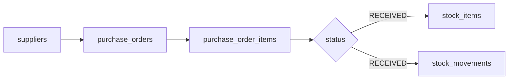
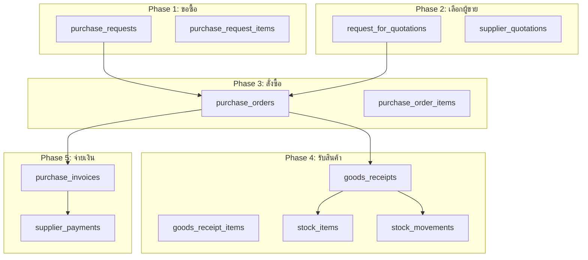

# วิเคราะห์ระบบการซื้อ (Purchase/Procurement) ปัจจุบัน

## 📊 สรุปสิ่งที่มีอยู่แล้ว

### Database Tables
```sql
suppliers          - ผู้จัดจำหน่าย
purchase_orders    - ใบสั่งซื้อ
purchase_order_items - รายการในใบสั่งซื้อ
```

### Flow ปัจจุบัน


---

## ✅ ฟีเจอร์ที่มีอยู่แล้ว

### 1. Supplier Management (ผู้จัดจำหน่าย)
| Feature | สถานะ | หมายเหตุ |
|---------|-------|----------|
| CRUD Supplier | ✅ | มีครบ |
| ประเภทผู้จัดจำหน่าย (RAW_MATERIAL) | ✅ | มีตาราง suppliers.type |
| Tax ID | ✅ | มี field |
| Payment Terms (NET30) | ✅ | มี field |
| Rating | ✅ | มี field |
| สถิติรวม (ยอดสั่งซื้อ/ใช้จ่าย) | ✅ | มีใน API |

**API Endpoints:**
```
GET    /api/suppliers
GET    /api/suppliers/stats
GET    /api/suppliers/:id
POST   /api/suppliers
PUT    /api/suppliers/:id
DELETE /api/suppliers/:id
```

### 2. Purchase Order (ใบสั่งซื้อ)
| Feature | สถานะ | หมายเหตุ |
|---------|-------|----------|
| CRUD PO | ✅ | มีครบ |
| PO Number Auto-gen | ✅ | PO-00001, PO-00002... |
| Status Flow | ⚠️ | DRAFT → SUBMITTED → APPROVED → RECEIVED/CANCELLED |
| Tax Calculation | ✅ | tax_rate, tax_amount |
| Subtotal/Total | ✅ | คำนวณถูกต้อง |
| Expected Date | ✅ | มี field |
| Received Date | ✅ | มี field (auto set) |
| Auto Stock Update | ✅ | ตอน RECEIVED อัปเดต stock อัตโนมัติ |
| Stock Movement | ✅ | บันทึก movement อัตโนมัติ |

**API Endpoints:**
```
GET    /api/purchase-orders
GET    /api/purchase-orders/stats
GET    /api/purchase-orders/:id
POST   /api/purchase-orders
PUT    /api/purchase-orders/:id
PUT    /api/purchase-orders/:id/status
DELETE /api/purchase-orders/:id
```

### 3. PO Status Flow ปัจจุบัน
```
DRAFT → SUBMITTED → APPROVED → RECEIVED
  ↓
CANCELLED
```

**สถานะที่มี:**
- `DRAFT` - ฉบับร่าง
- `SUBMITTED` - ส่งอนุมัติ
- `APPROVED` - อนุมัติแล้ว
- `RECEIVED` - รับสินค้าครบ
- `PARTIAL` - รับบางส่วน (มีใน code แต่ไม่สมบูรณ์)
- `CANCELLED` - ยกเลิก

---

## ❌ ฟีเจอร์ที่ขาดไป (เทียบ ERP มาตรฐาน)

### 1. Purchase Request (PR) - ใบขอซื้อ
**ปัจจุบัน:** ไม่มี สร้าง PO ได้เลย

**ที่ควรมี:**
```
พนักงาน/แผนก → สร้าง PR → หัวหน้าอนุมัติ → ฝ่ายจัดซื้อสร้าง PO
```

**ตารางที่ต้องเพิ่ม:**
```sql
purchase_requests
purchase_request_items
```

### 2. Partial Receipt (รับสินค้าบางส่วน)
**ปัจจุบัน:** รับครบเท่านั้น (RECEIVED) หรือไม่รับเลย

**ที่ควรมี:**
```
PO 100 ชิ้น → รับครั้งที่ 1: 30 ชิ้น → รับครั้งที่ 2: 40 ชิ้น → รับครั้งที่ 3: 30 ชิ้น
```

**ตารางที่ต้องเพิ่ม:**
```sql
goods_receipts          - ใบรับสินค้า (GRN)
goods_receipt_items     - รายการรับ
```

**ปัญหาปัจจุบัน:**
- purchase_order_items มี `received_qty` แต่ไม่มีการ track ว่ารับกี่ครั้ง
- ไม่มีใบรับสินค้า (GRN) แยก

### 3. Purchase Invoice (ใบแจ้งหนี้จากผู้ขาย)
**ปัจจุบัน:** ไม่มี บันทึกแค่ PO แล้วจ่ายเงินไม่ได้

**ที่ควรมี:**
```
ผู้ขายส่งของ → ส่งใบแจ้งหนี้ → ฝ่ายบัญชีบันทึก → จ่ายเงิน
```

**ตารางที่ต้องเพิ่ม:**
```sql
purchase_invoices       - ใบแจ้งหนี้ซื้อ
purchase_invoice_items  - รายการ
payments                - การจ่ายเงิน (เชื่อมกับ purchase_invoices)
```

### 4. Supplier Quotation (ใบเสนอราคาจากผู้ขาย)
**ปัจจุบัน:** ไม่มี

**ที่ควรมี:**
```
ขอใบเสนอราคา (RFQ) → เปรียบเทียบราคา → เลือกผู้ขาย → สร้าง PO
```

**ตารางที่ต้องเพิ่ม:**
```sql
request_for_quotations (rfq)
rfq_items
supplier_quotations
```

### 5. Supplier Evaluation (ประเมินผู้ขาย)
**ปัจจุบัน:** มี field `rating` แต่ไม่มีระบบประเมิน

**ที่ควรมี:**
```
ประเมินตาม: ราคา / คุณภาพ / ตรงเวลา / บริการ
```

### 6. Reorder Point (จุดสั่งซื้อใหม่)
**ปัจจุบัน:** ไม่มี ดูสต็อกเองแล้วสั่ง

**ที่ควรมี:**
```
min_stock = 10
max_stock = 100
reorder_point = 20
current_stock = 15 → Alert! ต้องสั่งซื้อ
```

### 7. Purchase Return (คืนสินค้า)
**ปัจจุบัน:** ไม่มี

**ที่ควรมี:**
```
รับสินค้า → ตรวจสอบเสียหาย → สร้างใบคืน → ลดยอดผู้ขาย
```

**ตารางที่ต้องเพิ่ม:**
```sql
purchase_returns
purchase_return_items
```

### 8. Blanket PO (สัญญาซื้อระยะยาว)
**ปัจจุบัน:** ไม่มี

**ที่ควรมี:**
```
สัญญาซื้อผ้า 1,000 หลา ราคา 50/หลา (1 ปี)
→ สั่งจริงทีละ 100 หลา ตามต้องการ
```

---

## 🔧 สิ่งที่ควรแก้ไข/ปรับปรุงด่วน

### 1. แยก Goods Receipt ออกจาก PO Status
**ปัญหา:** ตอนนี้เปลี่ยน status เป็น RECEIVED แล้วอัปเดต stock เลย

**แก้ไข:**
```sql
-- เพิ่มตาราง
CREATE TABLE goods_receipts (
  id TEXT PRIMARY KEY,
  gr_number TEXT NOT NULL,
  purchase_order_id TEXT NOT NULL,
  supplier_id TEXT NOT NULL,
  receipt_date TEXT DEFAULT CURRENT_TIMESTAMP,
  status TEXT DEFAULT 'DRAFT',
  ...
);

CREATE TABLE goods_receipt_items (
  id TEXT PRIMARY KEY,
  goods_receipt_id TEXT NOT NULL,
  po_item_id TEXT NOT NULL,
  received_qty REAL DEFAULT 0,
  ...
);
```

**Flow ใหม่:**
```
PO (APPROVED) → สร้าง GR → รับสินค้า → อัปเดต Stock → สร้างใบแจ้งหนี้
```

### 2. เพิ่ม Purchase Invoice (ใบแจ้งหนี้ซื้อ)
**ความสำคัญ:** สูง (ต้องการจ่ายเงินผู้ขาย)

**ตาราง:**
```sql
CREATE TABLE purchase_invoices (
  id TEXT PRIMARY KEY,
  pi_number TEXT NOT NULL,        -- ใบแจ้งหนี้จากผู้ขาย
  po_id TEXT NOT NULL,
  supplier_id TEXT NOT NULL,
  invoice_date TEXT,
  due_date TEXT,
  total_amount REAL DEFAULT 0,
  paid_amount REAL DEFAULT 0,
  status TEXT DEFAULT 'UNPAID',
  ...
);
```

### 3. เพิ่ม Payment (การจ่ายเงิน)
**ความสำคัญ:** สูง

**ตาราง:**
```sql
CREATE TABLE supplier_payments (
  id TEXT PRIMARY KEY,
  payment_number TEXT NOT NULL,
  supplier_id TEXT NOT NULL,
  purchase_invoice_id TEXT,
  amount REAL DEFAULT 0,
  payment_method TEXT,  -- CASH, TRANSFER, CHEQUE
  payment_date TEXT,
  ...
);
```

### 4. ปรับปรุง Partial Receipt
**ปัจจุบัน:** ไม่มีการ track การรับหลายครั้ง

**แก้ไข:**
- เพิ่มตาราง `goods_receipts` แยกออกมา
- เก็บประวัติการรับทุกครั้ง
- แสดงยอดค้างรับ (pending qty)

---

## 📋 ตารางสรุป Priority

| ฟีเจอร์ | ความสำคัญ | ความยาก | แนะนำ |
|---------|-----------|---------|-------|
| **Goods Receipt (GRN)** | 🔴 สูง | กลาง | **ทำก่อน** |
| **Purchase Invoice** | 🔴 สูง | กลาง | **ทำก่อน** |
| **Supplier Payment** | 🔴 สูง | กลาง | **ทำก่อน** |
| Purchase Request (PR) | 🟡 กลาง | กลาง | ทำทีหลัง |
| Purchase Return | 🟡 กลาง | กลาง | ทำทีหลัง |
| Supplier Quotation | 🟢 ต่ำ | สูง | ไม่ต้องรีบ |
| Blanket PO | 🟢 ต่ำ | สูง | ไม่ต้องรีบ |
| Reorder Point | 🟡 กลาง | ต่ำ | ทำได้เร็ว |

---

## 🎯 แนะนำการพัฒนา

### Phase 1: ด่วน (ทำทันที)
1. **Goods Receipt (GRN)** - รับสินค้าแยกจาก PO
2. **Purchase Invoice** - บันทึกใบแจ้งหนี้ผู้ขาย
3. **Supplier Payment** - จ่ายเงินผู้ขาย

### Phase 2: ปรับปรุง
4. **Purchase Request** - ขอซื้อก่อนสั่งซื้อ
5. **Purchase Return** - คืนสินค้า
6. **Reorder Point** - แจ้งเตือนสต็อกต่ำ

### Phase 3: ขั้นสูง
7. **RFQ & Supplier Quotation** - เปรียบเทียบราคา
8. **Blanket PO** - สัญญาระยะยาว
9. **Supplier Evaluation** - ประเมินผู้ขาย

---

## 📊 Flow ที่สมบูรณ์ (เป้าหมาย)



---

## ⚡ สรุปด่วน

**ที่มีแล้ว:**
- ✅ Supplier Management
- ✅ Purchase Order (พื้นฐาน)
- ✅ Auto Stock Update (ตอน RECEIVED)

**ที่ขาดด่วน (ต้องทำ):**
- ❌ **Goods Receipt (ใบรับสินค้า)** - รับหลายครั้งไม่ได้
- ❌ **Purchase Invoice** - ไม่มีใบแจ้งหนี้ซื้อ
- ❌ **Supplier Payment** - ไม่มีการจ่ายเงิน

**ต้องการให้เริ่มทำอันไหนก่อนครับ?** แนะนำ Goods Receipt ก่อน เพราะตอนนี้รับสินค้าบางส่วนไม่ได้ 🎯
